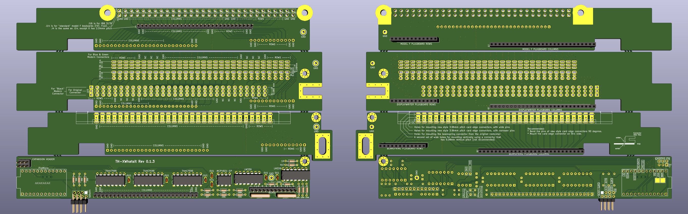

# TH-XWhatsIt

through hole implementation of the capsense controllers by XWhatsIt
(Tom Wong-Cornell). original liscencure holds, as well as CERN OSH
(compatible license).

original implementation of Tom Wong-Cornell's controller documented here

http://downloads.cornall.co/ibm-capsense-usb-web/ibm-capsense-usb.html

component documentation is supplied, working theory of operation is under
the previous link.

Please read the following files:

* [BOM.md](BOM.md) for Bill Of Materials.
* [ERRATA.md](ERRATA.md) for changes that must be made to older revision boards.
* [CHANGES.txt](CHANGES.txt) for all the detailed changes to this project over time.
* [PCB_ORDERING_INSTRUCTIONS.md](PCB_ORDERING_INSTRUCTIONS.md) for some notes on how to order PCBs.
